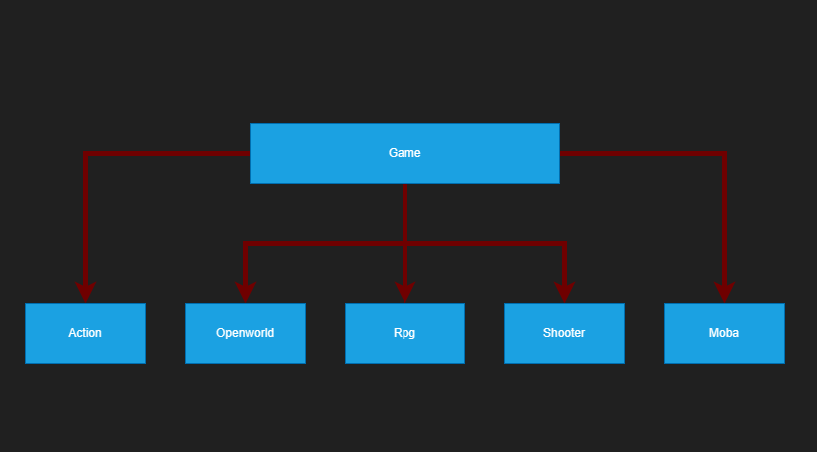

<h1 style = "color:#B70404"> <center> Game Library </h1> 

<h2 style = "color:#F8B400">Chapter 1: Introduction and Problem Statement</h2>

<p>This project is about a Game Library System which can store games' data, show them and can be added new games. The user can also delete the game data and update the info of the games. It is important to store the game data properly since digital copies of games are more popular nowadays and a proper game library is required to store them. This project aims to create a basic library system to store game data. It will create basic functions to store and load data, to add and delete new games, to show the saved games, to search games and to edit games. This project is created based on C++ using its Objected Oriented Programming, Dynamic Memory Management, File handling, error handling. Also features like inheritance, polymorphism and operator overloading is also used.</p>

<h2 style = "color:#F8B400">Chapter 2: Solution Design and Implementation</h2>

<h3 style="color:#FF6363">Design</h3>
<p>The program used OOP. Therefore it has classes-Library class, Game class, Action class,Moba class, Openworld class, Rpg class and shooter class. The Game class is a polymorphic base class for Action, Moba, Openworld, Rpg, Shooter classes. Those five derived classes represent one type of games each.</p>



<p>Library class is for storing the games class objects. From the library, users can interact with those objects. Library stores them with a polymorphic dynamic array. When a user starts the program a menu will pop up and display a list of commend to use the library and in this way the user will get access to the data that library stores.</p>

<h3 style="color:#FF6363">Implementation</h3>
<p><span style="color:#F8B400">"Game class"</span> has Attributes:<span style="color:#F8B400">"name,developer and rdate"</span>. "name and developer" are string variables. "rdate" is a struct datatype called date which has <span style="color:#F8B400">"day, month and year"</span> which are integer types. "name" stores name of the game, "developer" stores name of the developer and "rdate" stores the released date of the game. It has the following methods-</p>

```c++
    Game();
    Game(const Game& g);
    Game(string n,string d,date rd);
    virtual void display();
    virtual string getname();
    virtual string gettype();
    virtual void save(ofstream&)
    {
        return;
    }
    virtual void load(istream&)
    {
        return;
    }
```
<p>It has a default constructor,copy constructor and constructor with paramenters. Default constructor is for the library to be able to create polymorphic dynamic array of games without assigning any value to the attributes. The copy constructor is also needed when we copy the dynamic array. The last constructor is used to create and object with data to be stored in the library.The virtual methods are for using the actual methods of the derived classes. </p>
<p><span style="color:#F8B400">"Action, Openworld, Moba, Rpg and Shooter classes"</span> has the same attributes and methods as their base class. They have only one more attribute called <span style="color:#F8B400">"type"</span> which is a string variable. This attribute store the type of each derived class and it is the same as the class name. Although it would be much simpler to just use a game class without creating these derived classes, I would like to use the concept of polymorphism. This is because in a more advanced game library system, we will have to store the other data which might be different for each game type.</p>
<p><span style="color:#F8B400">"display()"</span> method show the data(attributes) of the objects of the classes.<span style="color:#F8B400">"getname(), gettype() "</span> returns the name and type of the object. <span style="color:#F8B400">"save(ofstream &output)"</span> get file object arguments and save the data of the object into the file object. The file object is for the binary file. This method saves the type of the game object twice first, because when we load the file, we need to create the respective object so that we will be able to load the data from the file correctly.Then the method saves the rest of the data. Before saving those data(excluding "rdate"), the size of each data is saved first because they are string data and when we load those data, we have to create a buffer with enough length to read them.<span style="color:#F8B400">"load(istream &input)"</span> method load the data from the file to the object. The size of each data is read first, then create a buffer and read the data. Then assign each buffer to the attributes. "rdata" can be simply read from the file without creating a buffer.</p> 
<p><span style="color:#F8B400">"Library class"</span> has the following structure.</p>

```c++
class Library
{

public:
    Library(); //default Constructor
    Library(const Library& l); // copy Constructor
    ~Library(); // Destructor
    void addgame(Game* g);
    void delgame(string gname);
    void search(string s)const;
    void showgenre(string s)const;
    void showgame()const;
    int gamenum();
    bool isin(string s);
    static void showgenre();
    void edit();
    void save(const string &filename) const;
    static Library load(const string &filename);
    void operator+=(Game *g);
    void operator-=(string gname);
private:

    int gameNum;
    Game** pData;

};
```
<p>The default constructor set the gameNum = 0 which shows the number of games in the library. It also set pData = NULL which is the array of game objects. The copy constructor perform deep copy from another object of the same class. It copy the data of another object into its array of games and set the gameNum = another object's gameNum. The destructor is explicitly defined because the array of objects need to be delete to prevent memory leakage. Inside the destructor, there is a loop to iterate all over the objects in the array and delete individually. Then the pData is deleted.</p>

<p><span style="color:#F8B400">"addgame(Game *g)"</span> add new games into the library array.This method uses a stack data structure to store the games into the array. First the name of the game is checked.If the name is the same to one of the games in the library, then the game is regarded as already in the system and the function does nothing. If the name is not the same, a temporary array with (gameNum+1) size is created to hold the data and the data is transferd through a loop.Then the new game is added to it and the original array of game of the library is deleted. Then the original array is set to point the same location as the temporary array and number of games is increased by one.</p>


<p><span style="color:#F8B400">"delgame(string gname)"</span> method chacks the given and if the name is not in the library it does nothing. Otherwise it creates a temporary array with(gameNum-1) size and copy the data of the original array excluding the data with the given name. Then the orignal array is deleted and the number of game is decreased by one.</p>


<p><span style="color:#F8B400">"search(string s)"</span> method will display the info of the object if the given string "s" is contained in the name of the objects. This is done with a loop and there is also a counter to count the number of games displayed.If no game is displayed the counter will be zero and the search result will be "not found".</p>

<p><span style="color:#F8B400">"showgenre(string s)"</span>This method is similar to search method. Instead of name, it checks type of the games. </p>

<p><span style="color:#F8B400">"showgame()"</span> method shows the data of all the game objects by iterating over all the objects with a loop.</p>

<p><span style="color:#F8B400">"gamenum()"</span>methods returns the value of gameNum.</p>

<p><span style="color:#F8B400">"isin(string s)"</span>methods check if the game with the given name(string s) is in the library or not by comparing with the name of the object. If it is in the library, the method returns true.</p>


<p><span style="color:#F8B400">"showgenre()"</span> is a static method which shows the types of the game that are available to store to or read from the library.</p>

<p><span style="color:#F8B400">"edit()"</span> methods ask the user the updated data of the game objects and create a new object with those data. Then replace that object to the original object in its place in the array with the help of copy constructor. So the original object copy the data.</p>

<p><span style="color:#F8B400">"save(const string &filename)"</span> method saves the data of the library into the given file in binary. If the file is not given in binary or the file cannot be created then an error is thrown. If there is no error, the gameNum is saved first and within the loop, each object in the array calls its save method to save their data.</p>

<p><span style="color:#F8B400">"load(const string &filename)"</span> is a static method which returns a Library object after the loading is finished. First the number of game is read from the file. Then it creates an array of the size of number of games. It iterates over the loop and within the loop, read the next data which is the type of the saved object. Then create an object of that type and call load method of the object to read data into that object. If the file is not found, an error is thrown.</p>

<p><span style="color:#F8B400">"operator+=(Game *g) and operator-=(string gname)"</span> methods call addgame and delgame respectively.</p>

<h3 style="color:Orange">"The main function"</h3>

<p><span style="color:#F8B400">"Menu(Library& lib)"</span>  shows a list of commends for the user to use the library. From those commends <span style="color:#F8B400">"addgame(Library& lib), deleteGame(Library& lib), search(const Library& lib),showGenre(const Library& lib)"</span> are called.</p>

<p><span style="color:#F8B400">"addgame(Library& lib)"</span>asks the user the data for the game to be added and add the game of the given type to the given library object by calling the respective library method. </p>

<p><span style = "color:#F8B400">"deleteGame(Library& lib), search(const Library& lib),showGenre(const Library& lib)"</span> delete the game, search and print the games acoording to the name or type from the given library by calling the respective library method.</p>

<p style="colour:#F8B400">"Menu function flowchart"</p>


<p>If an error is thrown, catch in the main function will process the error.</p>

<h2 style = "color:#F8B400">Chapter 3: Testing and Verification:</h2>
<p>Functional Testing will be emphasized for this project as I want to make sure this program runs smoothly and bug free for the user.</p>
<h3 style="color:#FF6363">Positive Test Cases</h3>

<p>When the user enter 1, by providing data a game is added successfully and by entering 3 the user can find the added games.</p>


<p>When the user enter 2, the program ask the name of the game and delete the game with that name.</p>


<p>When the user enter 4, the program shows all the game it has.</p>


<p>When the user enter 5 and provide the type of the game, the program shows the game of that type.</p>


<p>When the user enter 6 and provide the updated information, the program successfully updates the information.</p>


<h3 style="color:#FF6363">Negative Test Cases</h3>
<p>When the user enters a character other than a number, the program ouputs an error stream and print the menu again. When the user enters a number not shown on the menu, an error stream is displayed and the menu is printed again.</p>


<h3 style="color:#FF6363">Exit Test Cases</h3>
<p>When the user enter 0, the program exits successfully.</p>


<h3 style="color:#FF6363">Boundary Test Cases</h3>
<p>When the user inputs a game type that is not available for the library and inputs a date which is out of range, an error stream is printed.</p>


<h3 style="color:#FF6363">Verification</h3>
<p>This program runs correctly and outputs expected results.The users can add games to the library, delete games, search,list and edit games. Therefore, this program fulllfills the purpose of this project and solves the aimed problem.</p>

<h2 style = "color:#F8B400">Chapter 4: Results, Discussion, and Future Enhancements</h2>

<p>This project produces a simple game library system which uses only the standard library of C++. Although it is a simple library management system, it is powerful enough to store the games and perform basic functions of a library. It can also handle errors and exceptions without affecting the runtime. This program uses Object Oriented Programming, Dynamic Memory Management, error handling and file handling.Advanced features like inheritance. polymorphism and operator overloading. The biggest challenge is handling the polymorphic array to store the games. This program can be improved to more advanced game library with better graphical user interface(GUI) to store digital copy of games. The advanced library can be used for online game stores and playstation or xbox game.</p>

<h2 style = "color:#F8B400">Chapter 5: Conclusion and References</h2>

<p>This project is a really big challenge for me as I tried to use as much OOP features as I could. During implementation of the program, whenever I learnt a new OOP feature, I tried to use it for the program. It was difficult as those features are not familiar to me and there were a lot of errors to debug. However, it was a great learning opportunity to debug them, because I gained a lot of new knowledge about Object Oriented Programming. Nevertheless, I could finish my project with fully functional program, at last.</p>

<h3 style="color:#FF6363">References</h3>

<p>The following websites were used to understand more about OOP, File handling, Error handling and to debug the error I had during implementation.</p>

[1. geeksforgeeks](https://www.geeksforgeeks.org/)

[2. Stack Overflow](https://stackoverflow.com/)

[3. en.cppreference.com](https://en.cppreference.com/w/)


<h2 style="text-align: right;color:#B70404">YAUNGNI LINN LATT<br/>
BZH5R7</h2>


